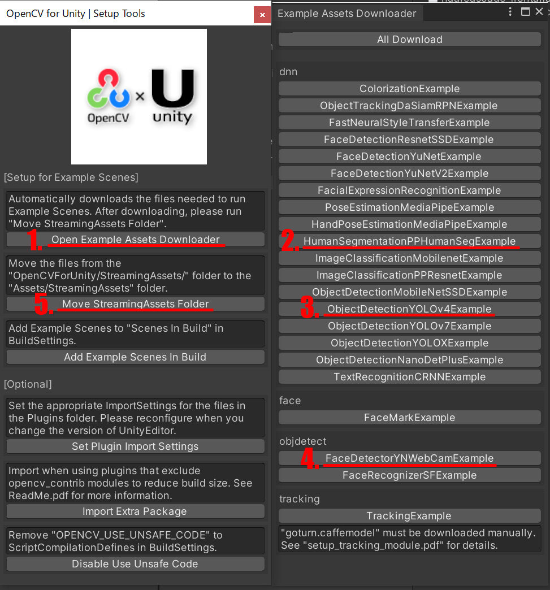

# NrealLight With OpenCVForUnity Example

## Demo Video

## Demo NrealLight App
* [NrealLightWithOpenCVForUnityExample.apk](https://github.com/EnoxSoftware/NrealLightWithOpenCVForUnityExample/releases)

## Environment
* Android (Galaxy S10+ SC-04L)
* Nreal Light (XREAL Light)
* Unity 2020.3.48f1+ (NRSDK supports the development environment of Unity 2018.4.X and above.)
* [NRSDK](https://developer.nreal.ai/download)  Unity SDK 1.10.2 
* [OpenCV for Unity](https://assetstore.unity.com/packages/tools/integration/opencv-for-unity-21088?aid=1011l4ehR) 2.5.6+ 

## Setup
1. Download the latest release unitypackage. [NrealLightWithOpenCVForUnityExample.unitypackage](https://github.com/EnoxSoftware/NrealLightWithOpenCVForUnityExample/releases)
1. Create a new project. (NrealLightWithOpenCVForUnityExample)
    * Change the platform to Android in the "Build Settings" window.
1. Import the OpenCVForUnity.
    * Select MenuItem[Tools/OpenCV for Unity/Open Setup Tools].
    * Click the [Open Example Assets Downloader] button.
    * Download files for examples ( HumanSegmentationExample, ObjectDetectionYolov4Example and FaceDetectionYNWebCamExample ) using the dnn, objdetect module.
    * Click the [Move StreamingAssets Folder] button.
    * Leave the following files and delete the rest. ("StreamingAssets/OpenCVForUnity/objdetect/haarcascade_frontalface_alt.xml", "lbpcascade_ frontalface.xml", "face_detection_yunet_2023mar.onnx","StreamingAssets/OpenCVForUnity/dnn/coco.names","yolov4-tiny.cfg","yolov4-tiny.weights","human_segmentation_pphumanseg_2023mar.onnx")
1. Import the NRSDK.
    * Download the latest release NRSDK unitypackage. [NRSDKForUnity_Release_1.xx.x.unitypackage](https://developer.nreal.ai/download)
    * Setup the NRSDK. (See [Getting Started with NRSDK](https://nreal.gitbook.io/nrsdk/nrsdk-fundamentals/quickstart-for-android))
1. Import the NrealLightWithOpenCVForUnityExample.unitypackage.
1. Add the "Assets/NrealLightWithOpenCVForUnityExample/*.unity" files to the "Scenes In Build" list in the "Build Settings" window.
1. Build and Deploy to Android device. (See [8. Deploy to Nreal Device](https://nreal.gitbook.io/nrsdk/nrsdk-fundamentals/quickstart-for-android#8.-deploy-to-nreal-device))
    *  (Print the AR marker "CanonicalMarker-d10-i1-sp500-bb1.pdf" on an A4 size paper)

|SetupTools_AssetsDownloader|Project Assets|Build Settings|
|---|---|
||||

## ScreenShot

